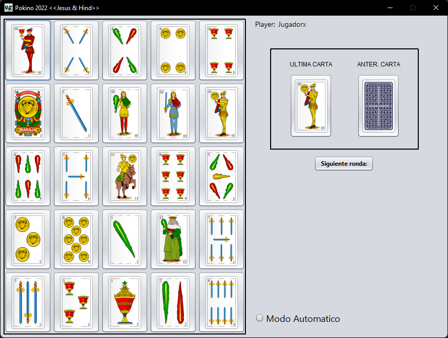

<!-- PROJECT LOGO -->
 

  

<h3 align="center">Pokino game <<Jesus && Hind>></h3>

<!-- ABOUT THE PROJECT -->
## About The Project

Pokino is a spanish game, the game consist on gain the prize "pokino" that it is 5 consecutive cards in any direction (horizontal, vertical or the two diagonals), also the game has diferent prize like center, poker, full, corner or stamp.

When we play pokino the game master gives you a paper with twenty five cards and some tokens to cover the cards, also if you want to be able to gain the prizes you have to pay some money each round its play the prize again.

